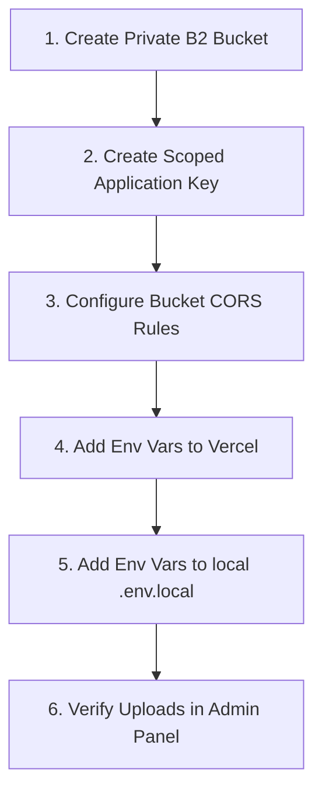

# Backblaze B2 Setup & Operations Guide

_Status: Current — 2026-08-25_

This guide covers the **manual external actions** required from the team (Nick/Aaron) to provision, configure, and activate Backblaze B2 for media storage in CrimsonC9.

For architectural decisions, see [ADR-0004](./adr/0004-backblaze-b2-media-storage.md) and [`concepts/CONCEPT_media-pipeline.md`](./concepts/CONCEPT_media-pipeline.md).

---

## What Has Been Implemented in Code

The codebase is now wired for B2:

1. **`@payloadcms/storage-s3`** is installed and configured in `src/payload.config.ts`.
2. **`clientUploads: true`** is enabled so browser uploads bypass Vercel's 4.5 MB serverless function limit and upload directly to B2.
3. **`signedDownloads`** with a 2-hour expiry (`7200s`) is enabled for media delivery and video streaming.
4. **`media` collection** in `src/collections/Media.ts` now accepts both `image/*` and `video/*`.
5. **Fallback:** If S3 environment variables are not set (e.g. offline dev), Payload falls back gracefully to local storage.

---

## Manual External Actions Required

Because the AI agent does not have access to your Backblaze account, DNS/Cloudflare, or Vercel dashboard, please complete the following steps:



---

### Step 1: Create B2 Bucket

1. Log into your [Backblaze B2 Admin Console](https://secure.backblaze.com/b2_buckets.htm).
2. Click **Create a Bucket**.
3. Configure the bucket:
   - **Bucket Unique Name:** `C9-Home-Storage` (or note the name if unique suffix needed).
   - **Files in Bucket are:** `Private` _(crucial for unreleased content protection)_.
   - **Default Encryption:** `Disabled` or `Enabled (SSE-B2)` (default is fine).
   - **Object Lock:** `Disabled` (or `Governance Mode` if enabled; **DO NOT** use `Compliance Mode`, as it prevents retention/deletion workflows).
   - **Lifecycle Rules / Versioning:** Set **Keep all versions** or **Keep prior versions for 30 days**.
4. Click **Create Bucket**.
5. Note the **Endpoint** and **Region** displayed in the bucket details (e.g., `s3.eu-central-003.backblazeb2.com` / `eu-central-003` or `s3.us-east-005.backblazeb2.com` / `us-east-005`).

---

### Step 2: Generate Scoped Application Key

**Never use the Master Application Key in the application.** Master keys can create and delete buckets and cannot be scoped.

1. Navigate to **Account** -> **Application Keys**.
2. Click **Add a New Application Key**.
3. Configure:
   - **Name of Key:** `c9-payload-media-app-key`
   - **Allow access to Bucket(s):** Select `C9-Home-Storage` only.
   - **Type of Access:** `Read and Write`.
   - **Allow List All Bucket Names:** `No` (or leave unchecked).
   - **File name prefix:** _(Leave blank to allow `media/`, `archive/`, `trash/`)_.
   - **Duration:** _(Leave blank for permanent until manual rotation)_.
4. Click **Create New Key**.
5. **Copy the credentials immediately** (the `applicationKey` is only shown once):
   - `keyID` $\rightarrow$ `S3_ACCESS_KEY_ID`
   - `applicationKey` $\rightarrow$ `S3_SECRET_ACCESS_KEY`

---

### Step 3: Configure CORS Rules on the Bucket

Because `clientUploads: true` sends uploads directly from the user's browser to Backblaze B2, B2 must permit `PUT` and `GET` requests from your frontend domains.

#### Option A: Using the official `b2` CLI

Install the B2 CLI:

- **Via `uv` (Recommended):** `uv tool install b2`
- **Via standalone binary (Linux):** `curl -LO https://github.com/Backblaze/B2_Command_Line_Tool/releases/latest/download/b2-linux && chmod +x b2-linux && sudo mv b2-linux /usr/local/bin/b2`
- **Via Homebrew (macOS):** `brew install b2-tools`
- **Via pipx:** `pipx install b2`

Authorize the CLI:

```bash
b2 account authorize <your-keyID> <your-applicationKey>
```

Apply the CORS rules to the bucket (`--cors-rules` flag in B2 CLI v4+):

```bash
b2 bucket update C9-Home-Storage --cors-rules '[
  {
    "corsRuleName": "c9DirectClientUploadsAndPlayback",
    "allowedOrigins": [
      "http://localhost:3000",
      "https://*.vercel.app",
      "https://crimsonc9.com",
      "https://www.crimsonc9.com"
    ],
    "allowedOperations": [
      "b2_upload_file",
      "b2_upload_part",
      "b2_download_file_by_id",
      "b2_download_file_by_name",
      "s3_put",
      "s3_get",
      "s3_head",
      "s3_post",
      "s3_delete"
    ],
    "allowedHeaders": [
      "*"
    ],
    "exposeHeaders": [
      "ETag",
      "Content-Length",
      "Content-Type",
      "Range"
    ],
    "maxAgeSeconds": 3600
  }
]'
```

#### Option B: Using AWS CLI (S3 API)

Create a local `cors.json`:

```json
{
  "CORSRules": [
    {
      "AllowedOrigins": [
        "http://localhost:3000",
        "https://*.vercel.app",
        "https://crimsonc9.com",
        "https://www.crimsonc9.com"
      ],
      "AllowedHeaders": ["*"],
      "AllowedMethods": ["GET", "PUT", "POST", "HEAD", "DELETE"],
      "ExposeHeaders": ["ETag", "Content-Length", "Content-Type", "Range"],
      "MaxAgeSeconds": 3600
    }
  ]
}
```

Run:

```bash
aws s3api put-bucket-cors \
  --endpoint-url https://s3.<your-region>.backblazeb2.com \
  --bucket C9-Home-Storage \
  --cors-configuration file://cors.json
```

---

### Step 4: Add Environment Variables in Vercel

In the [Vercel Dashboard](https://vercel.com/):

1. Go to **Settings** $\rightarrow$ **Environment Variables**.
2. Add the following variables across **Production**, **Preview**, and **Development**:

| Variable Name          | Example Value                               | Description                          |
| ---------------------- | ------------------------------------------- | ------------------------------------ |
| `S3_ENDPOINT`          | `https://s3.eu-central-003.backblazeb2.com` | Full S3 endpoint URL with `https://` |
| `S3_REGION`            | `eu-central-003`                            | Region string                        |
| `S3_BUCKET`            | `C9-Home-Storage`                           | Name of your private bucket          |
| `S3_ACCESS_KEY_ID`     | `003xxxxxxxxxxxx0000000001`                 | Scoped application keyID             |
| `S3_SECRET_ACCESS_KEY` | `K003xxxxxxxxxxxxxxxxxxxxxxxxxxxxxx`        | Scoped applicationKey                |

---

### Step 5: Add Environment Variables in `.env.local`

For local testing against B2, add the exact same variables to your local `.env.local` file:

```bash
# Backblaze B2 Storage
S3_ENDPOINT=https://s3.<region>.backblazeb2.com
S3_REGION=<region>
S3_BUCKET=C9-Home-Storage
S3_ACCESS_KEY_ID=<your-keyID>
S3_SECRET_ACCESS_KEY=<your-applicationKey>
```

---

### Step 6: Verification

1. Start your local server:
   ```bash
   npm run dev
   ```
2. Navigate to `http://localhost:3000/admin/collections/media`.
3. Upload a sample image and a sample video file.
4. Check your B2 bucket in the Backblaze dashboard:
   - You should see the files uploaded under the `media/` prefix.
5. View the media item in the admin UI or on a frontend page to ensure the signed presigned URL loads and plays correctly.
