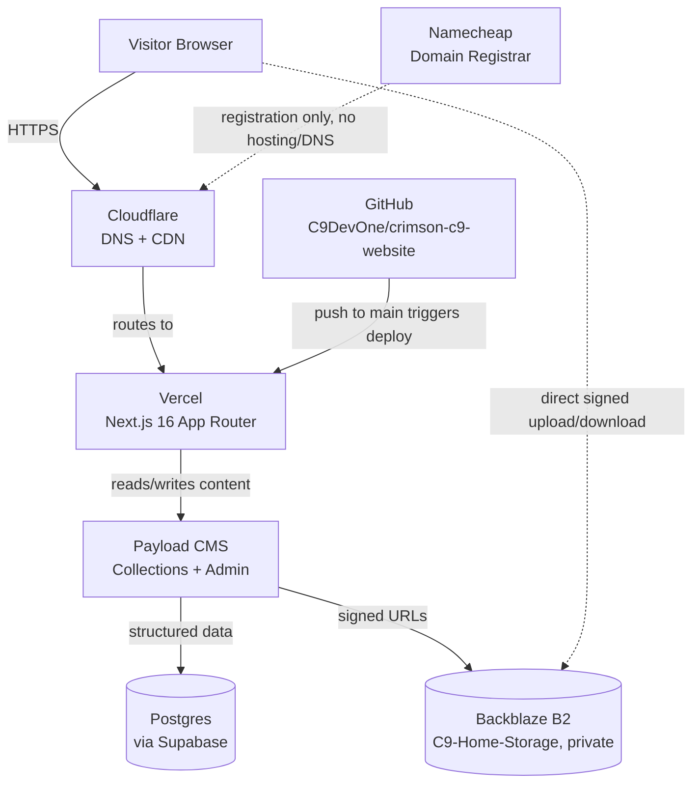

# CrimsonC9 — Tech Stack Overview

_Last updated: 2026-08-23_

Live, at-a-glance snapshot of what the project actually runs on today — kept current as the stack changes. For the reasoning behind any choice, see the matching ADR in [`/docs/adr/`](./adr/README.md). For deeper operational detail on a specific component, see the relevant `CONCEPT_*.md`.

## System Architecture

## Stack by Layer

| Layer              | Technology                       | Role                                                                                                                                               | More detail                                                                                 |
| ------------------ | -------------------------------- | -------------------------------------------------------------------------------------------------------------------------------------------------- | ------------------------------------------------------------------------------------------- |
| Framework          | Next.js 16 (App Router)          | React framework — SSR/RSC, powers the whole frontend. React 19, React Compiler enabled                                                             | [ADR-0001](./adr/0001-nextjs-app-router.md)                                                 |
| Language           | TypeScript                       | Type safety — `.ts`/`.tsx` only, no plain `.js`                                                                                                    | —                                                                                           |
| Styling            | Tailwind CSS v4                  | Utility-first styling, CSS variables for design tokens                                                                                             | —                                                                                           |
| Components         | Radix UI (+ shadcn — see note)   | Unstyled, accessible interactive primitives                                                                                                        | [ADR-0007](./adr/0007-radix-tailwind-component-layer.md)                                    |
| Animation          | Framer Motion + GSAP             | Component motion / scroll timelines — split still being finalized. **Duplicate packages installed**, see note                                      | [ADR-0008](./adr/0008-animation-library-framer-vs-gsap.md)                                  |
| 3D                 | Three.js + React Three Fiber     | WebGL scenes written as React components                                                                                                           | —                                                                                           |
| Smooth scroll      | Lenis                            | Pairs with GSAP ScrollTrigger. **Duplicate packages installed**, see note                                                                          | —                                                                                           |
| Icons              | lucide-react + react-icons       | UI icons / brand-social icons, kept deliberately separate                                                                                          | —                                                                                           |
| CMS                | Payload CMS                      | Self-hosted, code-first collections (Artists, Events, Releases, Posts, Media, Users, CollaborationRequests, UniqueVisitors)                        | [ADR-0002](./adr/0002-payload-cms-over-sanity.md)                                           |
| Database           | Postgres (via Supabase)          | Backing store for Payload, managed by Nick                                                                                                         | [ADR-0003](./adr/0003-postgres-via-supabase.md)                                             |
| Media storage      | Backblaze B2 (`C9-Home-Storage`) | **Planned, not yet wired.** Payload still writes to the local filesystem; `@payloadcms/storage-s3` is not installed. Architecture is fully specced | [ADR-0004](./adr/0004-backblaze-b2-media-storage.md) · `concepts/CONCEPT_media-pipeline.md` |
| Hosting            | Vercel                           | GitHub-connected deploys, PR preview URLs                                                                                                          | [ADR-0005](./adr/0005-vercel-hosting.md)                                                    |
| DNS / CDN          | Cloudflare                       | DNS + CDN + free B2 egress via Bandwidth Alliance                                                                                                  | [ADR-0006](./adr/0006-cloudflare-dns-namecheap-registrar.md)                                |
| Domain registrar   | Namecheap                        | Registration only — no hosting or DNS                                                                                                              | [ADR-0006](./adr/0006-cloudflare-dns-namecheap-registrar.md)                                |
| Ticketing          | Pretix                           | Self-hosted, GDPR-native — server deployment pending                                                                                               | [ADR-0009](./adr/0009-pretix-ticketing.md)                                                  |
| Payments (shop)    | Stripe Checkout                  | **Not in the prototype** — Shop is deferred (`concepts/CONCEPT_site-structure.md` §6). Listed as intended direction only                           | —                                                                                           |
| Version control    | GitHub                           | Branch-protected, Conventional Commits, Linear-linked branch names                                                                                 | —                                                                                           |
| Project management | Linear                           | Issue tracking — workspace: CrimsonC9, team: Website                                                                                               | —                                                                                           |
| AI-assisted coding | Claude Code, Gemini CLI          | Primed via `AGENTS.md` in the repo root, which points at these docs                                                                                | —                                                                                           |
| Email              | Zoho Mail                        | `hello@crimsonc9.com`                                                                                                                              | —                                                                                           |

## Notes on the table

**Component layer — Radix vs. shadcn.** [ADR-0007](./adr/0007-radix-tailwind-component-layer.md) records a decision to build directly on Radix primitives and explicitly sets shadcn aside. The codebase does not currently match: `shadcn` is a dependency, `components.json` is present, and `src/components/ui/` holds generated components (`button`, `input`, `sheet`, `sidebar`, `skeleton`, `tooltip`, `separator`). This is an unresolved conflict between an Accepted ADR and the code — tracked in `WORKING_LOG.md`, to be closed either by removing the drift or by writing an ADR that supersedes 0007. Do not treat either side as settled in the meantime.

**Duplicate animation / scroll packages.** Both `framer-motion` and `motion` (its renamed successor) are installed, as are both `lenis` and the deprecated `@studio-freight/lenis`. `ogl` is also present and documented nowhere. Each pair should collapse to one. Tracked in `WORKING_LOG.md`.
