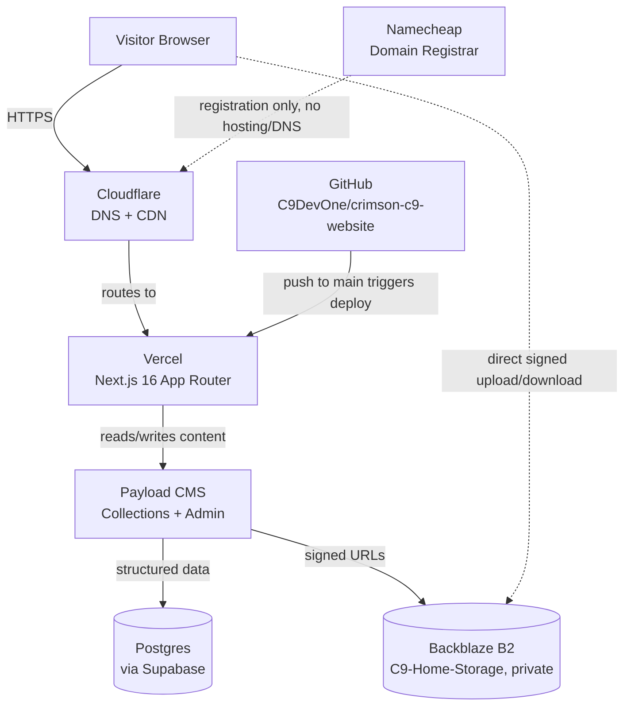

# CrimsonC9 — Tech Stack Overview

_Last updated: 2026-08-24_

Live, at-a-glance snapshot of what the project actually runs on today — kept current as the stack changes. For the reasoning behind any choice, see the matching ADR in [`/docs/adr/`](./adr/README.md). For deeper operational detail on a specific component, see the relevant `CONCEPT_*.md`.

## System Architecture

## Stack by Layer

| Layer               | Technology                       | Role                                                                                                                                                                   | More detail                                                                                                                                |
| ------------------- | -------------------------------- | ---------------------------------------------------------------------------------------------------------------------------------------------------------------------- | ------------------------------------------------------------------------------------------------------------------------------------------ |
| Framework           | Next.js 16 (App Router)          | React framework — SSR/RSC, powers the whole frontend. React 19, React Compiler enabled                                                                                 | [ADR-0001](./adr/0001-nextjs-app-router.md)                                                                                                |
| Language            | TypeScript                       | Type safety — `.ts`/`.tsx` only, no plain `.js`                                                                                                                        | —                                                                                                                                          |
| Styling             | Tailwind CSS v4                  | Utility-first styling, CSS variables for design tokens                                                                                                                 | —                                                                                                                                          |
| Components          | Radix UI + shadcn (scaffolding)  | Unstyled, accessible interactive primitives — shadcn's CLI scaffolds new ones on top of Radix                                                                          | [ADR-0010](./adr/0010-shadcn-scaffolding-on-radix.md)                                                                                      |
| Animation           | Framer Motion + GSAP             | Component motion / scroll timelines — split still being finalized                                                                                                      | [ADR-0008](./adr/0008-animation-library-framer-vs-gsap.md)                                                                                 |
| 3D                  | Three.js + React Three Fiber     | Installed, not yet used anywhere in the codebase — part of the intended stack per `VISION.md`, no scenes built yet                                                     | —                                                                                                                                          |
| WebGL (lightweight) | ogl                              | Backs the artist page's `CircularGallery` — a smaller, more direct WebGL API than Three.js/R3F for this specific use case                                              | —                                                                                                                                          |
| Smooth scroll       | Lenis                            | Pairs with GSAP ScrollTrigger — not yet wired up                                                                                                                       | —                                                                                                                                          |
| Icons               | lucide-react + react-icons       | UI icons / brand-social icons, kept deliberately separate                                                                                                              | —                                                                                                                                          |
| CMS                 | Payload CMS                      | Self-hosted, code-first collections (Artists, Events, Releases, Posts, Media, Users, CollaborationRequests, UniqueVisitors)                                            | [ADR-0002](./adr/0002-payload-cms-over-sanity.md)                                                                                          |
| Database            | Postgres (via Supabase)          | Backing store for Payload, managed by Nick                                                                                                                             | [ADR-0003](./adr/0003-postgres-via-supabase.md)                                                                                            |
| Media storage       | Backblaze B2 (`C9-Home-Storage`) | **Wired in code, bucket provisioning pending.** `@payloadcms/storage-s3` is installed with clientUploads and signedDownloads. Setup guide in `docs/BACKBLAZE_SETUP.md` | [ADR-0004](./adr/0004-backblaze-b2-media-storage.md) · `concepts/CONCEPT_media-pipeline.md` · [`BACKBLAZE_SETUP.md`](./BACKBLAZE_SETUP.md) |
| Hosting             | Vercel                           | GitHub-connected deploys, PR preview URLs                                                                                                                              | [ADR-0005](./adr/0005-vercel-hosting.md)                                                                                                   |
| DNS / CDN           | Cloudflare                       | DNS + CDN + free B2 egress via Bandwidth Alliance                                                                                                                      | [ADR-0006](./adr/0006-cloudflare-dns-namecheap-registrar.md)                                                                               |
| Domain registrar    | Namecheap                        | Registration only — no hosting or DNS                                                                                                                                  | [ADR-0006](./adr/0006-cloudflare-dns-namecheap-registrar.md)                                                                               |
| Ticketing           | Pretix                           | Self-hosted, GDPR-native — server deployment pending                                                                                                                   | [ADR-0009](./adr/0009-pretix-ticketing.md)                                                                                                 |
| Payments (shop)     | Stripe Checkout                  | **Not in the prototype** — Shop is deferred (`concepts/CONCEPT_site-structure.md` §6). Listed as intended direction only                                               | —                                                                                                                                          |
| Version control     | GitHub                           | Branch-protected, Conventional Commits, Linear-linked branch names                                                                                                     | —                                                                                                                                          |
| Project management  | Linear                           | Issue tracking — workspace: CrimsonC9, team: Website                                                                                                                   | —                                                                                                                                          |
| AI-assisted coding  | Claude Code, Gemini CLI          | Primed via `AGENTS.md` in the repo root, which points at these docs                                                                                                    | —                                                                                                                                          |
| Email               | Zoho Mail                        | `hello@crimsonc9.com`                                                                                                                                                  | —                                                                                                                                          |

## Notes on the table

**Component layer — Radix + shadcn.** [ADR-0007](./adr/0007-radix-tailwind-component-layer.md) originally set shadcn aside in favour of hand-built Radix primitives. [ADR-0010](./adr/0010-shadcn-scaffolding-on-radix.md) supersedes it: shadcn's CLI is used to scaffold new components (it generates a Radix-based file into the repo, then gets out of the way — not a runtime dependency), and every generated component's colour tokens are reskinned to reference the brand tokens rather than left as shadcn's defaults.
