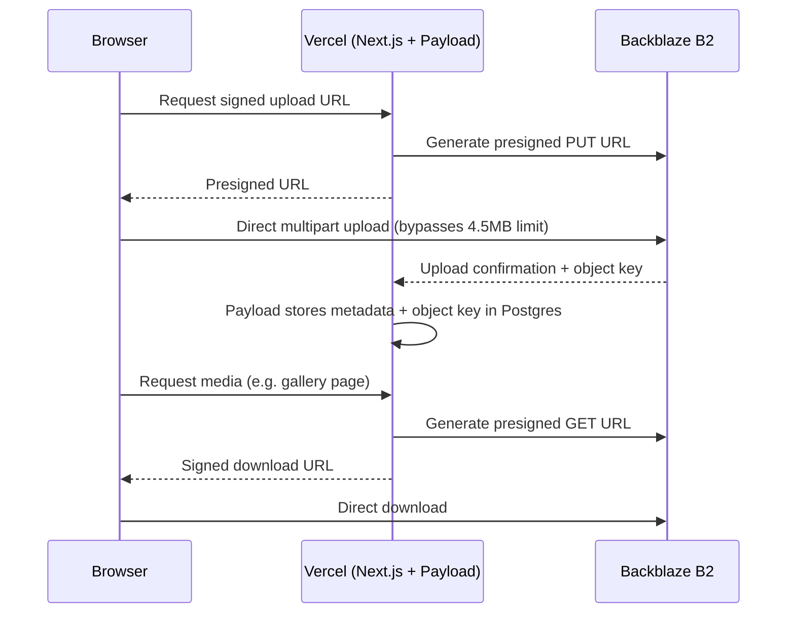

# ADR-0004: Backblaze B2 for Media Storage

**Status:** Accepted
**Date:** 2026-05
**Deciders:** Aaron, Nick

## Context

CrimsonC9 is media-heavy — event photos, artist portraits, and video masters. Large binary files are a poor fit for a relational database (they bloat backups, slow queries, and complicate migration), so the team needed dedicated object storage that fit the "own your data, own your stack" philosophy rather than deepening dependence on any single managed platform.

## Decision

**Backblaze B2** (bucket: `C9-Home-Storage`), kept **private**. All delivery goes through Payload's `signedDownloads` (short-lived presigned URLs) rather than a public bucket. Uploads use `clientUploads: true` on the S3 adapter so the browser uploads directly to B2, bypassing Vercel's 4.5 MB serverless function body limit — this requires a CORS PUT rule on the bucket.

## Alternatives Considered

- **AWS S3** — the S3 API baseline B2 is compatible with, but materially higher egress cost at media scale.
- **Supabase Storage** — would couple media storage to the same provider as the database, working against the project's deliberate decoupling of concerns, and is pricier at video scale.
- **Cloudflare R2** — a genuinely close alternative with zero egress fees. B2 was chosen instead because it pairs with the Cloudflare DNS already in place via the Bandwidth Alliance (free egress between B2 and Cloudflare), giving a comparable cost profile without needing to route storage through R2 specifically.

## Consequences

- **Positive:** Free egress via the Cloudflare Bandwidth Alliance; S3-compatible API keeps the option to migrate providers open; the database stays lean since it only stores object keys and metadata.
- **Negative:** A private bucket with signed URLs is more implementation work than a public bucket would be. The deletion lifecycle (flag → human confirmation → soft-delete to `trash/` → 30-day grace period → hard delete) required deliberate engineering, documented separately in `../concepts/CONCEPT_media-pipeline.md`. Object Lock in compliance mode was explicitly evaluated and ruled out as incompatible with this retention workflow.

## Flow

