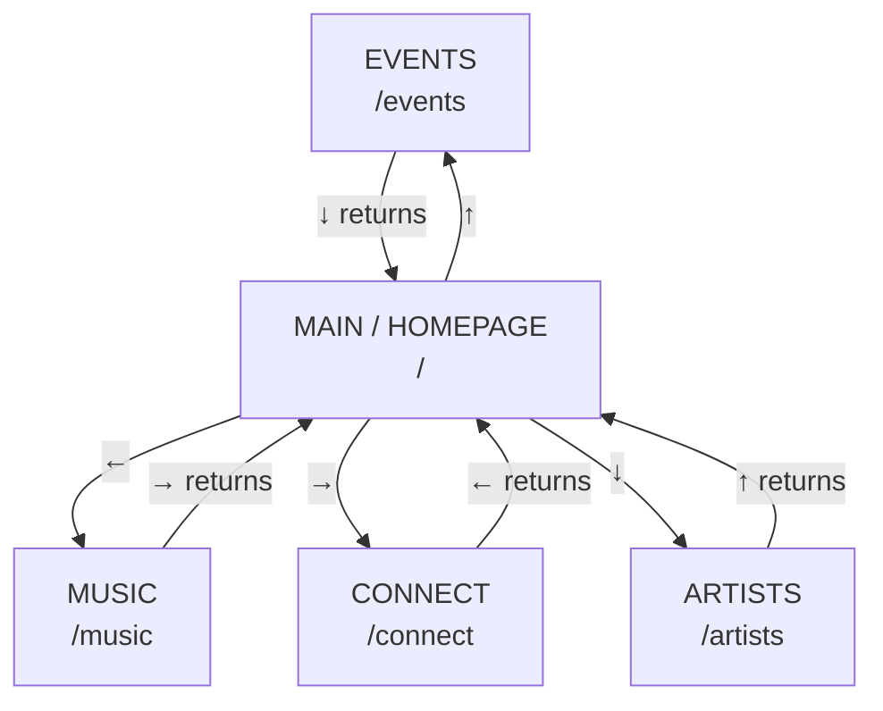

# CONCEPT: Site Structure & Navigation

_Status: Current — 2026-08-23_

Defines what pages exist, how they relate, and how visitors move between them. Per-page detail lives in the individual `CONCEPT_page-*.md` documents; this is the map, not the territory.

---

## 1. Navigation model

CrimsonC9 uses a **compass hub-and-spoke** structure rather than a conventional top navigation bar. The homepage is the hub. Four primary sections sit at compass points around it, reached by arrow key. Everything else is reached through the universal menu or the Connect affordance.

The intent is that navigation is itself part of the experience — orientation by direction rather than by reading a nav bar — while still degrading to ordinary clickable navigation for anyone who doesn't discover the keys.

Library is reachable through the universal menu only — not a compass direction. Connect's compass placement gives it two entry points site-wide (the compass and the global affordance, §3.3), reflecting its status as a more central page than Library.

### Routing

**These are real Next.js App Router routes, not sections of a single page.** Each compass point has its own URL, its own entry in the router, and its own page transition.

The reasoning matters here, because a single-page approach would make seamless transitions easier: real routes give shareable URLs (a booker can send someone straight to `/artists`), a working browser back button, and independently indexable pages for SEO. For a site whose entire purpose is discovery and outreach, losing those would cost more than the animation polish gains. Transitions between routes are handled at the layout level so the compass movement still feels continuous.

---

## 2. Route map

| Route                   | Section                    | Reached by                            | Status                                                |
| ----------------------- | -------------------------- | ------------------------------------- | ----------------------------------------------------- |
| `/`                     | Main / Homepage            | Entry point                           | Placeholder during build (§5)                         |
| `/events`               | Events                     | ↑ from Main, menu                     | Prototype scope                                       |
| `/events/[slug]`        | Individual archive entries | From `/events` archive                | Prototype scope                                       |
| `/artists`              | Artists                    | ↓ from Main, menu                     | Prototype scope                                       |
| `/music`                | Music                      | ← from Main, menu                     | Prototype scope                                       |
| `/library`              | The Library                | Menu only                             | Prototype scope                                       |
| `/connect`              | Connect                    | → from Main, Connect affordance, menu | Prototype scope                                       |
| `/about`                | About Us                   | Menu                                  | Prototype scope                                       |
| `/credits`              | Credits / Dev              | Menu                                  | Prototype scope — deliberately minimal                |
| `/artists/[slug]`       | Individual artist pages    | —                                     | **Deferred** (§6)                                     |
| `/shop`                 | Shop                       | —                                     | **Deferred** (§6)                                     |
| `tickets.crimsonc9.com` | Ticketing                  | Embedded in `/events`                 | Separate deployment (§4) — platform not yet finalized |

**Also currently in the codebase**, predating this concept and not part of the compass model. Listed so the map isn't misleading — each still needs a decision on whether it survives into the prototype:

| Route                           | Section                     | Status                                                                                                      |
| ------------------------------- | --------------------------- | ----------------------------------------------------------------------------------------------------------- |
| `/contact`                      | Contact form                | Pre-prototype. Overlaps the contact form scoped into `/connect` §4 — likely folded in or removed.           |
| `/imprint` · `/terms`           | Legal (Impressum, ToS)      | Pre-prototype. Legally required in DE; keep, but not yet placed in the menu or this map's navigation model. |
| `/support`                      | Support                     | Pre-prototype. Purpose unclear against the current scope — resolve or remove.                               |
| `/dev/tokens` · `/dev/featured` | Internal dev/preview routes | Internal only. Should not be reachable in production.                                                       |
| `/admin/dashboard`              | Team admin surface          | Internal, behind Payload auth.                                                                              |

---

## 3. Navigation rules

These apply site-wide. Page-specific interactions are documented in each page's own concept doc.

### 3.1 Directional navigation

Arrow keys move between Main and the four compass sections. **The return is always the opposite arrow from the one that took you there** — Events sits above Main, so `↓` returns; Connect sits to the right, so `←` returns. This makes direction meaningful rather than arbitrary: the visitor is moving around a space, not cycling through a list.

### 3.2 Universal menu (the lantern)

Present on **every** page, top-left corner. Opens the full section list. This is the guaranteed navigation path — everything reachable by arrow key is also reachable here, so the compass is an enhancement rather than a requirement.

Menu contents: Artists · About Us · Connect · Library · Events · Music · Credits

Sections that don't exist yet are **not rendered at all** — no greyed-out or "coming soon" entries. (Shop is therefore absent from the prototype menu.)

Full interaction detail: `CONCEPT_page-universal-menu.md`

### 3.3 Connect affordance

A glowing circle in the **lower-right corner**, present globally, that transitions to `/connect` on click. It is deliberately not an arrow-key destination — Connect is an action the visitor takes rather than a place on the map, and the visual metaphor of "connecting" carries the interaction.

_Provisional:_ global placement is the current intent, to be reviewed once it's visible in context — it may end up homepage-only if it competes with page content elsewhere.

### 3.4 Discoverability

**Every non-obvious interaction ships with a visible affordance.** Arrow-key navigation is invisible to a mouse user by default, so each page carries an on-screen hint for how to move — the pattern established in the Events concept (`"Press ↓ to move back"`) is the model. Visual treatment of these hints is refined per page; their presence is not optional.

### 3.5 Viewport

**Desktop-first for the prototype**, with a mobile pass immediately following — not deferred to a distant phase. A minimum-width guard prevents the desktop layout breaking on small screens in the interim.

Because all primary navigation is currently keyboard-driven, the mobile pass requires touch equivalents for each directional interaction. That work is scoped in the mobile pass, not solved here.

### 3.6 Nested states

Some pages have states nested more than one level deep beyond the page itself — the Artists page's Hologram mode, an individual Events archive entry. In these cases, **back-navigation always unwinds one level at a time.** Esc closes or exits the innermost state first, returning to that page's own base state — it never skips straight to Main. The compass arrow that returns to Main only fires from a page's base state, never from a nested one.

Confirmed examples: Artists (`CONCEPT_page-artists.md` §4), Events archive entries (`CONCEPT_page-events.md` §2), and Music's viewer state (`CONCEPT_page-music.md` §1). Library (`CONCEPT_page-library.md` §3) extends the same idea one level deeper still — category → resource, not just page → single nested state — and covers the variant case of a page with no compass arrow of its own: for a menu-only page, Esc at the top level steps up out of the page entirely to Main, since there's no dedicated return arrow to hand that job to. Treat this as the default pattern for any future page that gains a similarly nested state, rather than deciding it fresh each time.

---

## 4. Page summaries

Short descriptions only — each has its own concept doc with full detail.

**Main / Homepage `/`** — Entry point and compass hub. Animated dragon, environmental motion, scroll-down journey introducing the collective ("Who we are" → Artists, "What we do" → Events, "How you can connect" → Connect). Location line rotates between Aachen, Berlin, and Cologne. The C9 logo appears after scrolling and persists on all other pages.

**Events `/events`** — Video-background entry screen carrying "Change Through Music", pulling its footage from the archive's highlight section with a static fallback. Below: upcoming events with links through to ticketing, a partners/collaborators section, and a chronological archive of past events with galleries. All event content is CMS-managed.

**Artists `/artists`** — "Meet the C9 Family". A dormant spaceship-and-plants environment with a holographic projector at rest; Enter activates it, revealing one artist's full profile at a time, cycled with the arrow keys. Esc closes the hologram back to the dormant scene. Each profile carries name, short bio, location, booking contact, social links, and media, with a background that changes per artist. Booking routes to a contact form at `booking@crimsonc9.com`.

**Music `/music`** — An immersive viewer framing embedded media rather than a conventional player page: EPs and podcasts via SoundCloud, full sets via YouTube, with a sound-reactive background. Video plays in a focused "cinema mode" (Enter opens, Esc exits); audio adds quick track-cycling (←/→) within the viewer. EP/demo submissions go via contact form or `music@crimsonc9.com`; podcast submissions use the existing podcast submission form — two separate paths, not shared.

**The Library `/library`** — A curated collection of guides and tools for music production, video, and DJing; open-source or C9-tested. Simple and visually organised, built to scale later. No user accounts or search in v1.

**Connect `/connect`** — "Connect Yourself". A decorative glowing node network sets the tone; the real links sit in a conventional icon row (YouTube, SoundCloud, Instagram) beneath it. Single continuous scrolling page — no nested state, unlike the other interior pages. WhatsApp communities (C9 Raves, C9-Berlin, Announcements) are CMS-managed. Collaboration contact form includes a priority toggle. Volunteer/community openings are descriptive text, not a managed list.

**About Us `/about`** — History and identity of CrimsonC9, with an invitation to connect and explore further.

**Credits / Dev `/credits`** — Contributor and build credits. Deliberately minimal.

### Ticketing

The purchase flow is embedded directly into `/events` rather than linking out to a separate ticket page or shop — settled, so the visual identity holds through checkout regardless of which platform sits behind it.

**The platform itself is not yet decided.** Pretix is the current leading candidate (self-hosted, fits the ownership philosophy), but this is still a proposal, not an accepted decision — see [`ADR-0009`](../adr/0009-pretix-ticketing.md), status Proposed.

_Historical note:_ a Weeztix-based portal served the previous event and is now stale, scheduled for removal regardless of what replaces it long-term.

---

## 5. Placeholder during build

**The intent:** while the prototype is under construction, `/` serves a **single-page under-construction placeholder** — social links, contact, and a small dragon-under-construction visual. Deliberately light: it is a holding page, not a product.

**Not yet the case.** As of 2026-08-23 the repo still serves the stale "Bunker Dreams" Weeztix ticket portal at `/`, and the interior routes listed above are live rather than sealed off — the `_`-prefix disabling described in [`ADR-0009`](../adr/0009-pretix-ticketing.md) has already been reverted. Building the placeholder and decommissioning the portal are both tracked as pending actions in `WORKING_LOG.md`.

Once the placeholder is up, all other routes stay unreachable until the prototype is ready to open up.

---

## 6. Explicitly out of scope

Named here so scope doesn't creep in quietly. These are deferrals, not rejections.

| Item                                      | Status                                                                                                                                                                                |
| ----------------------------------------- | ------------------------------------------------------------------------------------------------------------------------------------------------------------------------------------- |
| Individual artist pages `/artists/[slug]` | **Deferred.** The dormant/hologram experience is the full artist experience for v1. Individual pages — including artists customising their own space — remain the eventual direction. |
| Artist self-serve accounts                | Deferred.                                                                                                                                                                             |
| Shop `/shop`                              | Deferred. Ideas captured (apparel, 3D-printed goods) but out of the prototype entirely; not rendered in the menu.                                                                     |
| Broadcast / News                          | **Scrapped** for now. Previously planned; removed from scope.                                                                                                                         |
| Library "forbidden section"               | **Removed.** The restricted-section aesthetic may return gated on harmless content.                                                                                                   |
| Library search & user accounts            | Deferred.                                                                                                                                                                             |
| Mobile layout                             | Not in the prototype, but scheduled immediately after — not a distant phase.                                                                                                          |

---

## 7. Open questions

- **Homepage environmental motif** — clouds and starfield are both candidates. Non-essential; to be decided visually rather than on paper.
- **Connect affordance placement** — global vs. homepage-only (§3.3).
- **Partners / collaborators** — the Events partners section needs a home in the content model; no collection defined yet.
- **Contact form priority field** — to be included; behaviour on submission not yet defined.
